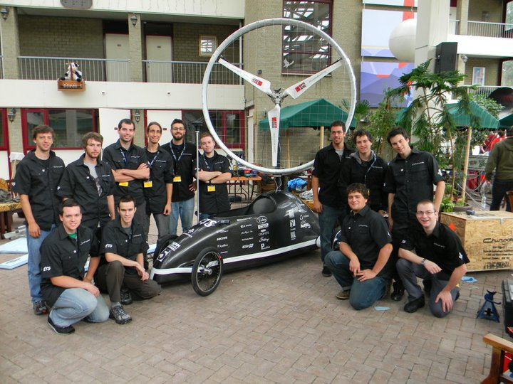

Le Chinook 1
============

L'équipe du Chinook 1
=====================
- Julien Deschamps-Francoeur
- Olivier Laurin
- Patrice Gouin O'Shaughnessey
- Cedric Somers
- David Khouya
- Louis-Charles Trudeau
- Pierre-Luc Mailloux
- Guillaume Cyr
- Gabriel Lemay-Gosselin
- Alexandre Lacombe
- Nicolas McCrae
- Alexandre Caron
- Antoine Letarte
- Kéven Boutin
- Vincent Caux-Brisebois

Les commanditaires du Chinook 1
===============================

### PLATINE

- École de technologie supérieure

### OR

- Polymères Technologies
- RPM Développement Durable
- Usimm
- AÉÉTS
- ARGENT
- 5N Plus
- Huntsman
- Banque Nationale
- Campbell
- JB Martin

### BRONZE

- COOP ÉTS
- EL Cargo
- GianMajor Inc.
- Freeman Manufacturing
- Element 51
- Loctite
- Minicut Int.
- Précifab
- Rio Tinto Alcan
- Tuba
- Soucy Int.
- Vignoble L’Orpailleur
- Fromagerie Vache à Maillotte
