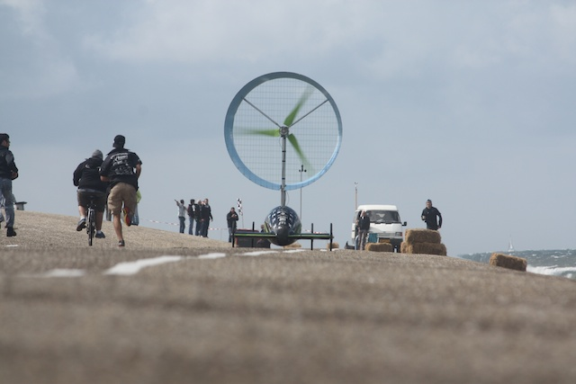
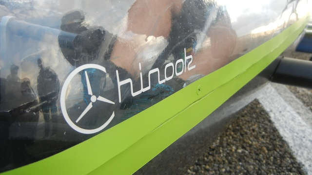

Le projet
=========

Concevoir un **véhicule à propulsion éolienne** ayant la capacité de remonter un vent de face:
telle est la mission des membres du club scientifique Chinook ETS.

C’est dans le but d’atteindre la plus grande efficacité énergétique possible qu’est développée
la voiture monoplace, et ce, dans l’optique de participer à la compétition internationale
Racing Aeolus, qui se tient annuellement aux Pays-Bas.

Notre mission
=============

Dans un contexte mondial de changements climatiques et d’augmentation de 
la demande mondiale énergique, notre mission est de développer un véhicule 
à propulsion éolienne afin d’explorer les alternatives qu’offrent les sources 
d’énergie renouvelable, en remplacement aux combustibles fossiles.

Le Chinook croit en l’innovation technologique et technique, le travail d’équipe,
l’ambition et la passion qui caractérisent les clubs étudiants de l’École de
technologie supérieure, et oriente donc ses efforts dans la même direction.

Nous nous engageons à performer en compétition dans le cadre de l’événement 
Racing Aeolus, à repousser les limites de l’ingénierie en efficacité 
énergétique et à exceller sur le plan de la conception durable. 
Vice-Champions du monde en 2011, et champion du monde en 2012 Chinook 3 
vise cette année fracasser le record de la compétition

Le défi est grand, notre conviction l’est davantage!
